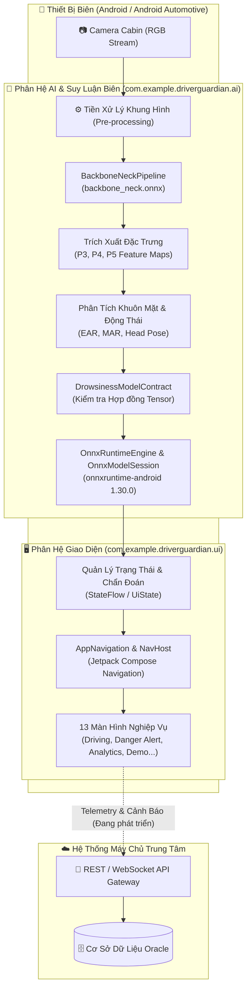
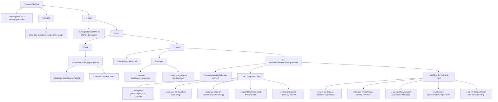
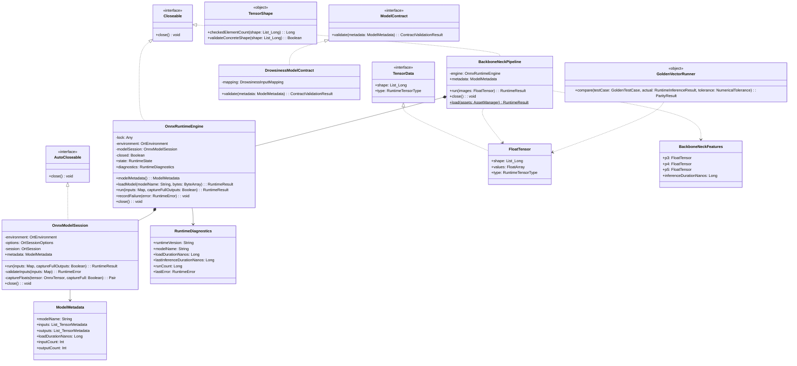
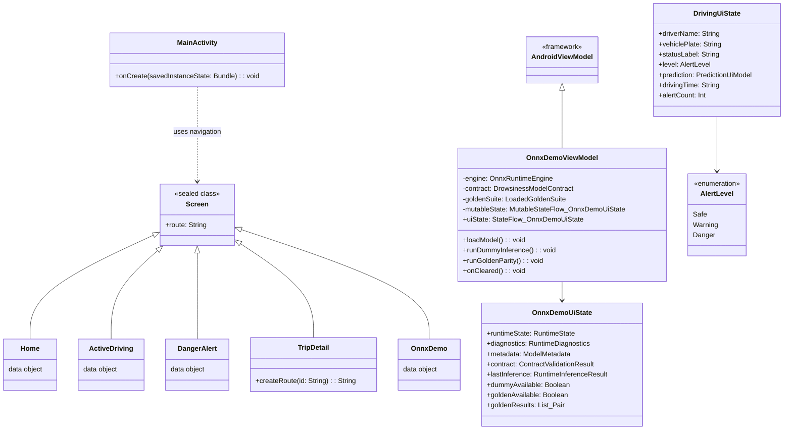
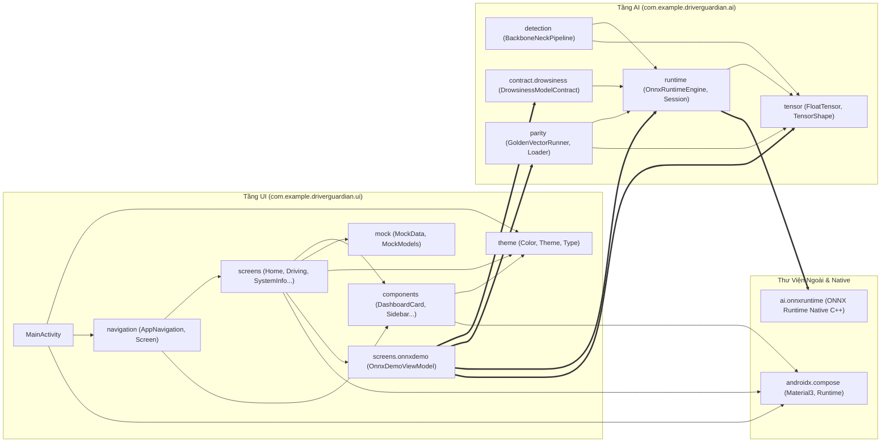
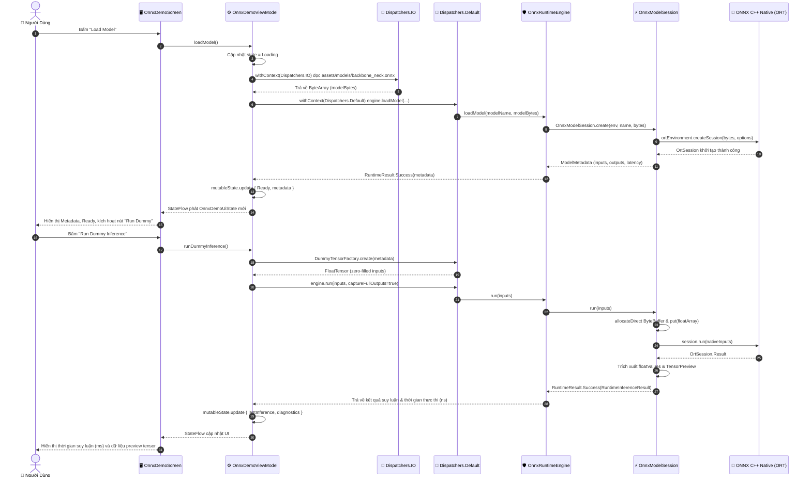
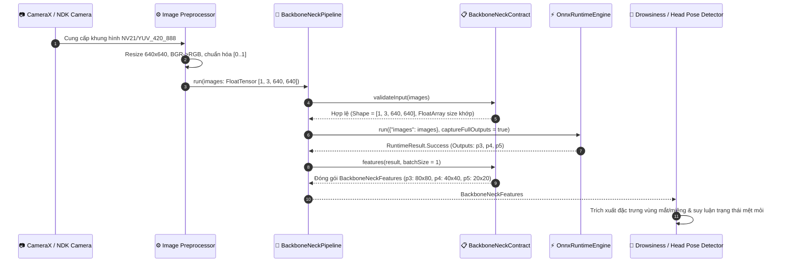
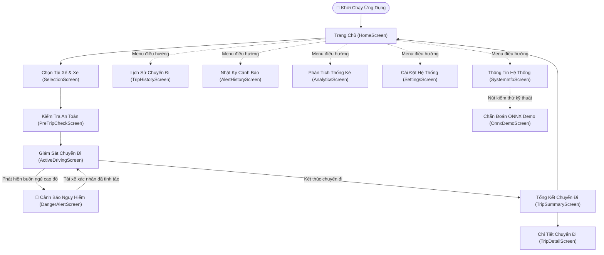

# Driver Guardian — Kiến Trúc Hệ Thống, Tổ Chức File, Class & Phụ Thuộc Module

Tài liệu này mô tả chi tiết toàn bộ kiến trúc hệ thống **Driver Guardian (Android System)**, cấu tạo từng module, tổ chức file/class, cách thức import và luồng dữ liệu thông qua các biểu đồ **Mermaid**.

---

## 1. Tổng Quan Kiến Trúc Toàn Hệ Thống

Hệ thống Driver Guardian được thiết kế theo mô hình **Edge AI kết hợp Giám sát Thời Gian Thực (Real-time Driver Monitoring System - DMS)**. Ứng dụng chạy trên thiết bị di động và môi trường ô tô thông minh (**Android Automotive / Tablet HUD**), trực tiếp thực thi các mô hình học máy (ONNX Runtime) trên phần cứng biên (On-device Edge AI) để bảo vệ quyền riêng tư và tối ưu độ trễ cảnh báo.

---

## 2. Cấu Trúc Tổ Chức Thư Mục & Tập Tin (File Organization)

Hệ thống mã nguồn Android được tổ chức trong module gốc `:app` với gói package chuẩn `com.example.driverguardian`, phân chia ranh giới rõ rệt giữa tầng giao diện (`ui`), tầng suy luận trí tuệ nhân tạo (`ai`), tài nguyên mẫu (`assets`), công cụ phát triển (`scripts`) và kiểm thử (`test`).

### 2.1. Sơ Đồ Cây Thư Mục Trực Quan

### 2.2. Bảng Kê Chi Tiết Toàn Bộ File Trong Hệ Thống

| Nhóm / Package | Đường Dẫn File | Vai Trò & Trách Nhiệm Cốt Lõi |
| :--- | :--- | :--- |
| **Cấu hình & Điểm vào** | `system/android/build.gradle.kts` | Cấu hình Gradle root, plugin Kotlin & Android. |
| | `system/android/settings.gradle.kts` | Định nghĩa module `:app` và kho lưu trữ maven (Google, MavenCentral). |
| | `system/android/app/build.gradle.kts` | Định nghĩa compileSdk 36, Java 17, Compose BOM, `onnxruntime-android:1.30.0`. |
| | `app/src/main/AndroidManifest.xml` | Khai báo Single Activity (`MainActivity`), khóa hướng màn hình ngang (landscape). |
| | `MainActivity.kt` | Điểm vào duy nhất của app, thiết lập theme và khởi chạy `DriverGuardianApp`. |
| **UI - Navigation** | `ui/navigation/Screen.kt` | Sealed class định nghĩa các Route điều hướng an toàn (Home, Driving, OnnxDemo...). |
| | `ui/navigation/AppNavigation.kt` | Quản lý `NavHostController`, responsive layout (Sidebar >= 720dp, BottomBar < 720dp). |
| **UI - Screens** | `ui/screens/home/HomeScreen.kt` | Màn hình chính: tổng quan trạng thái hệ thống, nút bắt đầu chuyến đi. |
| | `ui/screens/selection/SelectionScreen.kt` | Chọn tài xế và phương tiện trước khi khởi hành. |
| | `ui/screens/pretrip/PreTripCheckScreen.kt` | Danh sách kiểm tra điều kiện an toàn (Camera, AI Model, Cảm biến, Mạng). |
| | `ui/screens/driving/ActiveDrivingScreen.kt` | Màn hình HUD lái xe: hiển thị chỉ số EAR, MAR, Head Pose, mức cảnh báo. |
| | `ui/screens/driving/DangerAlertScreen.kt` | Màn hình cảnh báo nguy hiểm mức cao nhất (toàn màn hình, ẩn sidebar). |
| | `ui/screens/summary/TripSummaryScreen.kt` | Báo cáo tóm tắt khi kết thúc chuyến đi (thời gian lái, số cảnh báo). |
| | `ui/screens/history/TripHistoryScreen.kt` | Danh sách lịch sử các chuyến đi đã hoàn thành. |
| | `ui/screens/history/TripDetailScreen.kt` | Chi tiết từng chuyến đi theo Route `trip_detail/{id}`. |
| | `ui/screens/alerts/AlertHistoryScreen.kt` | Lịch sử nhật ký các lần phát hiện buồn ngủ và cảnh báo. |
| | `ui/screens/analytics/AnalyticsScreen.kt` | Báo cáo thống kê xu hướng tập trung của tài xế theo tuần/tháng. |
| | `ui/screens/settings/SettingsScreen.kt` | Thiết lập ngưỡng cảnh báo âm thanh, độ nhạy phát hiện, cấu hình HUD. |
| | `ui/screens/system/SystemInfoScreen.kt` | Thông tin phiên bản phần mềm, phần cứng và lối tắt mở màn hình ONNX Demo. |
| | `ui/screens/onnxdemo/OnnxDemoScreen.kt` | Giao diện kiểm thử, chẩn đoán mô hình ONNX, chạy dummy input & parity test. |
| | `ui/screens/onnxdemo/OnnxDemoViewModel.kt` | ViewModel quản lý nạp mô hình, chạy suy luận ONNX, kiểm tra contract và parity. |
| **UI - Components** | `ui/components/AppSidebar.kt` | Thanh điều hướng bên sườn dành cho tablet / màn hình ô tô kích thước lớn. |
| | `ui/components/DashboardCard.kt` | Thẻ hiển thị thông tin dashboard với hiệu ứng nền bo góc. |
| | `ui/components/PrimaryActionButton.kt` | Nút bấm thao tác chính với trạng thái loading và icon. |
| | `ui/components/StatusIndicator.kt` | Chỉ báo trạng thái hoạt động (Xanh: Tốt, Vàng: Cảnh báo, Đỏ: Lỗi). |
| | `ui/components/AiAnalyticsCharts.kt` | Biểu đồ trực quan hóa dữ liệu AI (tần suất chớp mắt, tỷ lệ nhắm mắt P80). |
| | `ui/components/MockBarChart.kt` | Biểu đồ cột Canvas Compose phục vụ trực quan hóa dữ liệu mô phỏng. |
| | `ui/components/EmptyState.kt` | Giao diện hiển thị khi danh sách trống hoặc chưa có dữ liệu. |
| | `ui/components/MetricCard.kt` | Thẻ đo lường thông số vận hành (vận tốc, thời gian lái liên tục). |
| **UI - Mock & Theme**| `ui/mock/MockModels.kt` | Các cấu trúc dữ liệu UI: `DrivingUiState`, `AlertLevel`, `DriverUiModel`, v.v. |
| | `ui/mock/MockData.kt` | Dữ liệu mẫu phục vụ phát triển giao diện độc lập với backend. |
| | `ui/mock/AiAnalyticsMockData.kt` | Dữ liệu mẫu chuỗi thời gian cho đồ thị phân tích mệt mỏi. |
| | `ui/theme/Color.kt` | Bảng màu Material 3 chuyên dụng cho ô tô (SafeGreen, WarningYellow, DangerRed). |
| | `ui/theme/Theme.kt` | Cấu hình Dark/Light ColorScheme và Theme Wrapper `DriverGuardianTheme`. |
| | `ui/theme/Type.kt` | Cấu hình Typography chữ dễ đọc trong môi trường rung lắc trên ô tô. |
| **AI - Runtime** | `ai/runtime/OnnxRuntimeEngine.kt` | Lớp bọc cấp cao quản lý vòng đời một phiên ONNX (`loadModel`, `run`, `close`). |
| | `ai/runtime/OnnxModelSession.kt` | Lớp nội bộ đóng gói `OrtSession`, chuyển đổi FloatTensor sang bộ nhớ native. |
| | `ai/runtime/OrtTypeMapper.kt` | Ánh xạ kiểu dữ liệu giữa ONNX native `OnnxJavaType` và `RuntimeTensorType`. |
| | `ai/runtime/RuntimeMetadata.kt` | Cấu trúc dữ liệu metadata: `TensorMetadata`, `ModelMetadata`, `RuntimeDiagnostics`. |
| | `ai/runtime/RuntimeState.kt` | Sealed class biểu diễn trạng thái: NotLoaded, Loading, Ready, Running, Failed, Closed. |
| | `ai/runtime/RuntimeError.kt` | Sealed class định nghĩa hệ thống lỗi chi tiết và Result wrapper `RuntimeResult<T>`. |
| **AI - Tensor** | `ai/tensor/TensorData.kt` | Sealed interface `TensorData` và cài đặt `FloatTensor` lưu mảng số thực. |
| | `ai/tensor/TensorShape.kt` | Kiểm tra tính hợp lệ của Shape, chống tràn số học khi tính tổng phần tử. |
| | `ai/tensor/DummyTensorFactory.kt` | Tạo dữ liệu đầu vào giả lập (zero-filled tensor) để kiểm tra mô hình. |
| | `ai/tensor/TensorPreviewFactory.kt` | Trích xuất chuỗi xem trước (head/tail) dữ liệu tensor để hiển thị trên UI. |
| **AI - Contract** | `ai/contract/drowsiness/ModelContract.kt` | Interface thẩm định mô hình `ModelContract` và `ContractValidationResult`. |
| | `ai/contract/drowsiness/DrowsinessModelContract.kt` | Xác thực cấu trúc 4 tensor đầu vào (mắt, miệng, hình học) và 1 đầu ra. |
| | `ai/contract/drowsiness/DrowsinessInputMapping.kt` | Ánh xạ ngữ nghĩa tên node (Left Eye, Right Eye, Mouth, Geometry). |
| **AI - Detection** | `ai/detection/BackboneNeckPipeline.kt` | Pipeline nạp `backbone_neck.onnx`, trích xuất 3 mức đặc trưng không gian P3, P4, P5. |
| **AI - Parity** | `ai/parity/GoldenTestCase.kt` | Cấu trúc test case so sánh kết quả số học từ Python với Android. |
| | `ai/parity/GoldenVectorAssetLoader.kt` | Nạp file `manifest.json` và đọc tensor nhị phân little-endian từ assets. |
| | `ai/parity/GoldenVectorRunner.kt` | Bộ so sánh sai số số học tuyệt đối (`atol`) và tương đối (`rtol`). |
| | `ai/parity/NumericalTolerance.kt` | Cấu hình ngưỡng sai số chấp nhận được (`NumericalTolerance.Configured`). |
| **Scripts & Test** | `scripts/generate_backbone_neck_reference.py` | Kịch bản Python chạy PyTorch/ONNX sinh vector chuẩn tham chiếu (`.f32`). |
| | `app/src/test/ai/BackboneNeckContractTest.kt` | Unit test kiểm tra tính đúng đắn của hợp đồng Backbone+Neck. |
| | `app/src/test/ai/OnnxFoundationTest.kt` | Unit test kiểm tra chống tràn số, dummy tensor và kiểm tra hợp đồng. |

---

## 3. Cấu Tạo Chi Tiết Các Module & Subsystem

### 3.1. Phân Hệ Giao Diện Người Dùng (`ui`)
Tầng `ui` được xây dựng hoàn toàn bằng **Jetpack Compose**, tuân thủ nguyên tắc thiết kế Declarative UI:
- **Routing & Responsive**: [Screen.kt](file:///home/tranmanhduy/Workspace/ptithcm/driver-guardian/system/android/app/src/main/java/com/example/driverguardian/ui/navigation/Screen.kt) sử dụng sealed class giúp định tuyến kiểu an toàn (type-safe). [AppNavigation.kt](file:///home/tranmanhduy/Workspace/ptithcm/driver-guardian/system/android/app/src/main/java/com/example/driverguardian/ui/navigation/AppNavigation.kt) áp dụng `BoxWithConstraints` để tự động chuyển đổi giữa `AppSidebar` (màn hình rộng >= 720dp) và `NavigationBar` (màn hình nhỏ).
- **MVI / MVVM Trong OnnxDemo**: [OnnxDemoViewModel.kt](file:///home/tranmanhduy/Workspace/ptithcm/driver-guardian/system/android/app/src/main/java/com/example/driverguardian/ui/screens/onnxdemo/OnnxDemoViewModel.kt) kế thừa `AndroidViewModel`, quản lý luồng bất đồng bộ:
  - Đọc file mô hình từ Android Assets trên `Dispatchers.IO`.
  - Thực thi nạp session ONNX và tính toán suy luận trên `Dispatchers.Default`.
  - Phát trạng thái bất biến thông qua `StateFlow<OnnxDemoUiState>` tới giao diện Compose.

### 3.2. Phân Hệ Suy Luận AI Biên (`ai`)
Tầng `ai` hoàn toàn độc lập với Android UI và framework giao diện, có thể chạy trong môi trường Unit Test chuẩn JVM:
1. **Quản Lý Vòng Đời ONNX (`ai.runtime`)**:
   - [OnnxRuntimeEngine](file:///home/tranmanhduy/Workspace/ptithcm/driver-guardian/system/android/app/src/main/java/com/example/driverguardian/ai/runtime/OnnxRuntimeEngine.kt) áp dụng mẫu thiết kế Thread-Safe Wrapper với đối tượng khóa `synchronized(lock)`, đảm bảo không bao giờ xảy ra Race Condition khi vừa nạp mô hình vừa thực hiện suy luận.
   - [OnnxModelSession](file:///home/tranmanhduy/Workspace/ptithcm/driver-guardian/system/android/app/src/main/java/com/example/driverguardian/ai/runtime/OnnxModelSession.kt) chịu trách nhiệm cấp phát bộ nhớ Direct Buffer (`ByteBuffer.allocateDirect`), sắp xếp thứ tự byte gốc (`ByteOrder.nativeOrder()`) để chuyển dữ liệu vào C++ native code mà không bị chi phí sao chép bộ nhớ dư thừa. Tự động đóng tensor native trong khối `finally`.
2. **Trừu Tượng Hóa Dữ Liệu Tensor (`ai.tensor`)**:
   - [FloatTensor](file:///home/tranmanhduy/Workspace/ptithcm/driver-guardian/system/android/app/src/main/java/com/example/driverguardian/ai/tensor/TensorData.kt) chứa mảng `FloatArray` phẳng kèm theo danh sách chiều `shape: List<Long>`.
   - [TensorShape](file:///home/tranmanhduy/Workspace/ptithcm/driver-guardian/system/android/app/src/main/java/com/example/driverguardian/ai/tensor/TensorShape.kt) ngăn chặn triệt để lỗi tràn số học (Integer/Long Overflow) khi nhân các chiều ma trận bằng hàm `Math.multiplyExact()`.
3. **Thẩm Định Hợp Đồng Mô Hình (`ai.contract`)**:
   - [DrowsinessModelContract](file:///home/tranmanhduy/Workspace/ptithcm/driver-guardian/system/android/app/src/main/java/com/example/driverguardian/ai/contract/drowsiness/DrowsinessModelContract.kt) giải quyết bài toán chống suy đoán sai node name: Vì 3 input chuỗi ảnh (mắt trái, mắt phải, miệng) đều có chung shape `[1, 30, 3, 64, 64]`, contract từ chối tự động ghép nối nếu không có ánh xạ tường minh (`Explicit Mapping`).
4. **Pipeline Trích Xuất Đặc Trưng (`ai.detection`)**:
   - [BackboneNeckPipeline](file:///home/tranmanhduy/Workspace/ptithcm/driver-guardian/system/android/app/src/main/java/com/example/driverguardian/ai/detection/BackboneNeckPipeline.kt) nạp mô hình `backbone_neck.onnx`, nhận đầu vào ảnh RGB chuẩn hóa `[B, 3, 640, 640]` và trích xuất đồng thời 3 bản đồ đặc trưng đa tỷ lệ:
     - `p3`: Shape `[B, 64, 80, 80]` (Đặc trưng tỷ lệ lớn, độ phân giải cao)
     - `p4`: Shape `[B, 128, 40, 40]` (Đặc trưng tỷ lệ trung bình)
     - `p5`: Shape `[B, 256, 20, 20]` (Đặc trưng tỷ lệ nhỏ, ngữ nghĩa cao)
5. **Kiểm Chứng Số Học Chuẩn PyTorch (`ai.parity`)**:
   - [GoldenVectorRunner](file:///home/tranmanhduy/Workspace/ptithcm/driver-guardian/system/android/app/src/main/java/com/example/driverguardian/ai/parity/GoldenVectorRunner.kt) tính toán sai số tuyệt đối $max|a - e|$ và sai số tương đối $max\frac{|a - e|}{|e|}$, so sánh với ngưỡng sai số cho phép ($atol + rtol \times |e|$) để khẳng định tính tương thích số học hoàn hảo giữa mô hình huấn luyện bằng Python và mô hình chạy trên Android.

---

## 4. Sơ Đồ Lớp (Class Diagrams)

### 4.1. Sơ Đồ Lớp Tầng Trí Tuệ Nhân Tạo & Runtime (`com.example.driverguardian.ai.*`)

### 4.2. Sơ Đồ Lớp Tầng Giao Diện & Quản Lý Trạng Thái (`ui.*`)

---

## 5. Quy Tắc Import & Luồng Phụ Thuộc Module (Import Architecture)

### 5.1. Nguyên Tắc Phân Tầng Phụ Thuộc (Clean Architecture Principles)

Hệ thống tuân thủ nghiêm ngặt mô hình phụ thuộc một chiều (**Unidirectional Dependency Flow**):
1. **Độc lập Tầng AI (`ai` layer)**:
   - Các package `ai.runtime`, `ai.tensor`, `ai.contract`, `ai.detection`, `ai.parity` **tuyệt đối không import** bất kỳ class nào từ tầng `ui` hoặc framework Android UI (`androidx.compose.*`, `android.view.*`).
   - Phân hệ `ai` chỉ phụ thuộc vào `ai.onnxruntime.*`, Java/Kotlin Standard Library và một số ít tiện ích Android cơ bản như `android.content.res.AssetManager`.
2. **Tầng Giao Diện (`ui` layer)**:
   - Tầng `ui` quan sát và kích hoạt chức năng của tầng `ai` gián tiếp thông qua **ViewModel** (`OnnxDemoViewModel`) hoặc các Pipeline chuyên biệt.
   - Các màn hình UI nghiệp vụ chỉ làm việc với UI State (`DrivingUiState`, `OnnxDemoUiState`) và Data Model mô phỏng (`MockModels`).
3. **Không Phụ Thuộc Vòng Tròn (No Circular Dependencies)**:
   - Luồng dữ liệu và tham chiếu import luôn chảy từ tầng ngoài (UI) vào tầng trong (Domain/AI Runtime).

### 5.2. Biểu Đồ Ma Trận Import Giữa Các Gói Mã Nguồn

### 5.3. Bảng Chi Tiết Quan Hệ Import Cụ Thể Từng Package

| Package Nguồn | Các Package Được Phép Import | Mục Đích Sử Dụng |
| :--- | :--- | :--- |
| `ui.navigation` | `ui.screens.*`, `ui.components.*`, `androidx.navigation.*` | Điều phối chuyển màn hình, gắn layout sidebar/bottom bar. |
| `ui.screens.onnxdemo` | `ai.contract.drowsiness.*`, `ai.parity.*`, `ai.runtime.*`, `ai.tensor.*` | Quản lý vòng đời mô hình, gửi input, nhận output suy luận và kết quả parity. |
| `ui.screens.*` | `ui.components.*`, `ui.mock.*`, `ui.theme.*`, `androidx.compose.*` | Hiển thị giao diện người dùng, đọc dữ liệu trạng thái. |
| `ai.detection` | `ai.runtime.*`, `ai.tensor.*`, `android.content.res.AssetManager` | Đóng gói pipeline trích xuất đặc trưng Backbone+Neck. |
| `ai.contract.drowsiness` | `ai.runtime.ModelMetadata`, `ai.runtime.RuntimeTensorType` | Kiểm tra tính tương thích giữa metadata mô hình ONNX và hợp đồng tensor. |
| `ai.parity` | `ai.runtime.RuntimeInferenceResult`, `ai.tensor.*`, `org.json.*` | Đọc manifest dữ liệu chuẩn và so sánh số học với đầu ra runtime. |
| `ai.runtime` | `ai.tensor.*`, `ai.onnxruntime.*` | Điều khiển C++ native ONNX engine, ánh xạ bộ nhớ trực tiếp. |
| `ai.tensor` | `ai.runtime.RuntimeTensorType` | Định nghĩa cấu trúc mảng FloatTensor và kích thước ma trận. |

---

## 6. Luồng Tương Tác & Dữ Liệu Thời Gian Thực (Execution & Data Flows)

### 6.1. Luồng Nạp Mô Hình & Suy Luận Trong ONNX Demo

Biểu đồ tuần tự dưới đây mô tả quá trình từ khi người dùng bấm nút trên giao diện cho đến khi ONNX Runtime xử lý dữ liệu native và phản hồi kết quả về UI State:

### 6.2. Luồng Trích Xuất Đặc Trưng Không Gian Trong Pipeline Thị Giác Máy Tính

Khi tích hợp camera thực tế, `BackboneNeckPipeline` sẽ hoạt động theo luồng:

### 6.3. Vòng Đời Điều Hướng Người Dùng (User Navigation Lifecycle)

---

## 7. Tổng Kết

Kiến trúc mã nguồn Android của **Driver Guardian** đạt được sự phân tách trách nhiệm tối ưu:
1. **Module hóa chặt chẽ**: Tách bạch 100% giữa Tầng Trí tuệ Nhân tạo (`ai`) và Tầng Giao diện người dùng (`ui`).
2. **An toàn kiểu & bộ nhớ**: Đóng gói C++ ONNX native code với cơ chế Direct ByteBuffer, đồng bộ đa luồng (`synchronized lock`), giải phóng bộ nhớ tự động, kiểm tra shape chống tràn số học.
3. **Khả năng mở rộng**: Dễ dàng tích hợp thêm các head phân loại (Drowsiness Head, Distraction Head, Head Pose SQPnP) vào `BackboneNeckPipeline` mà không làm thay đổi kiến trúc giao diện hiện tại.
